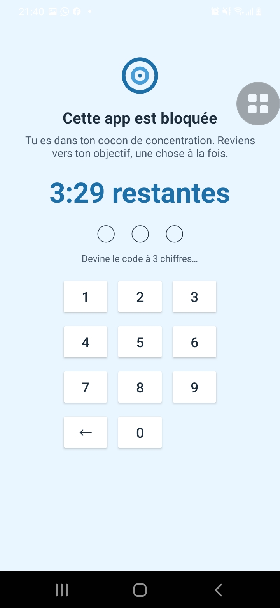
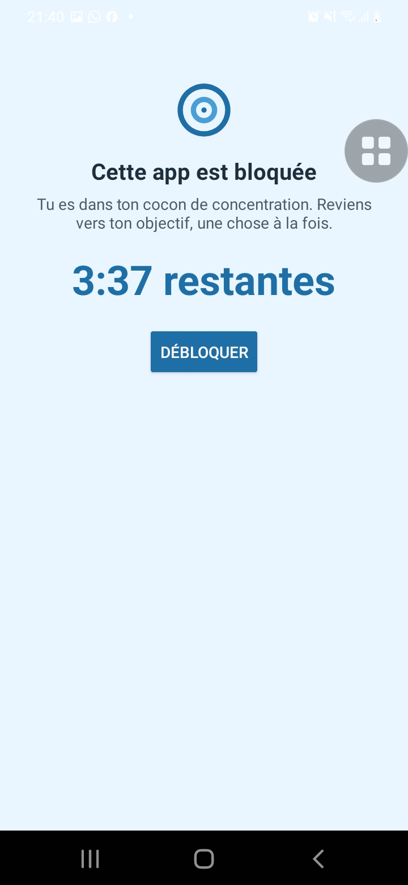
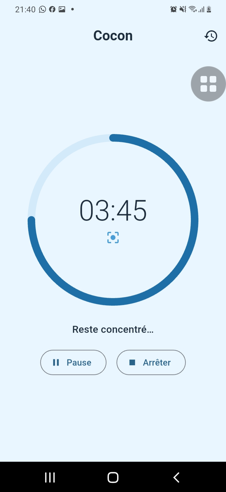
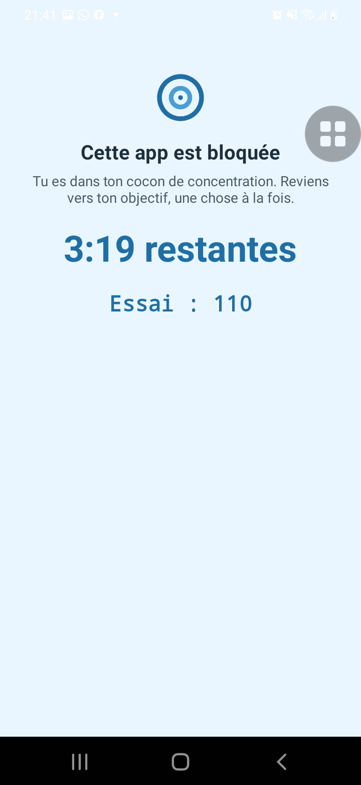

# Cocon 🧘

**Cocon** transforme ton téléphone en outil de concentration : pendant une session, les applications que tu as choisies sont bloquées. Impossible de tricher pour sortir avant la fin, il faut trouver le code.

<p align="center">
  
  
  
  
</p>

## Fonctionnalités

- **Sessions de concentration** minuteur circulaire, durées prédéfinies (15, 25, 45, 60, 90 min)
- **Blocage réel des apps** quand une app bloquée s'ouvre pendant une session, un écran de blocage prend le dessus instantanément
- **Résistant aux contournements** détection par événements d'accessibilité **+** sondage de la fenêtre active toutes les 500 ms (fonctionne même en rouvrant depuis les apps récentes)
- **Code PIN secret** un code à 3 chiffres est généré aléatoirement à chaque session, stocké côté natif, jamais affiché
- **Deux façons de sortir avant la fin** :
  - *Deviner le code* au pavé numérique
  - *Brute force* : une animation essaye toutes les combinaisons (100 → 999) une par une jusqu'à trouver il faut mériter sa sortie
- **Aucun arrêt possible depuis l'app** ni pause, ni stop : la session ne s'achève que par le chrono ou le code
- **Historique & statistiques** sessions terminées/interrompues, minutes concentrées par semaine
- **100 % hors ligne** aucune donnée ne quitte le téléphone

## Captures

| Blocage en action | Sortie par code |
|---|---|
| L'app bloquée est recouverte par l'écran Cocon avec le temps restant | « Débloquer » propose de deviner le code ou de lancer le brute force |

## Architecture

### Flutter (interface)
| Élément | Rôle |
|---|---|
| `lib/providers/focus_provider.dart` | État central : session, minuteur, apps bloquées, historique |
| `lib/services/native_bridge.dart` | Pont MethodChannel vers le natif (tolérant hors Android) |
| `lib/services/local_store.dart` | Persistance locale (SharedPreferences) |
| `lib/theme.dart` | Thème bleu ciel Material 3 |

### Android natif (blocage)
| Élément | Rôle |
|---|---|
| `CoconAccessibilityService` | Détecte l'app au premier plan (événements + polling 500 ms) |
| `BlockingActivity` | Écran de blocage : chrono, pavé PIN, animation brute force |
| `SessionStateManager` | État de session persistant (fin, apps, PIN) survit à un kill |
| `SessionAlarmScheduler` + `SessionEndReceiver` | Alarme exacte de fin de session + notification |

## Compilation

```bash
flutter pub get
flutter run   # sur un appareil Android connecté
```

Premier lancement : activer le service dans **Réglages Android → Accessibilité → Services installés → Cocon** (l'app affiche une bannière qui guide vers les réglages).

> App Android développée avec Flutter, testée sur Samsung Galaxy A20e (Android 11).

## Télécharger

[](https://github.com/stonekamara/cocon/releases/download/v1.0.0/app-release.apk)

> Android affichera un avertissement « application inconnue » : autorise simplement l'installation (l'app n'est pas sur le Play Store).

Toutes les versions : [Releases](https://github.com/stonekamara/cocon/releases)

## Licence

Projet personnel tous droits réservés.
